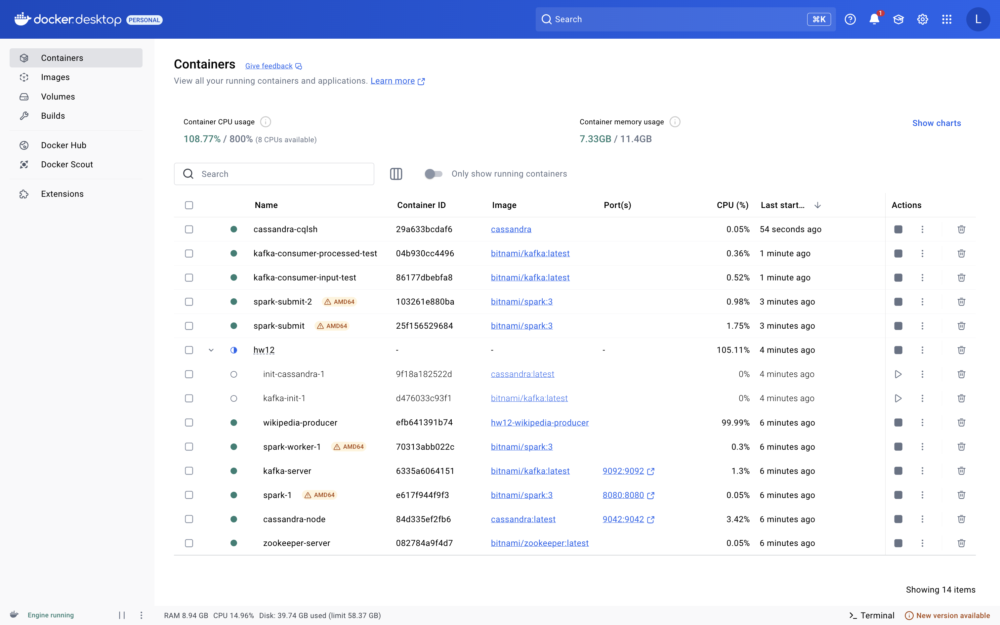
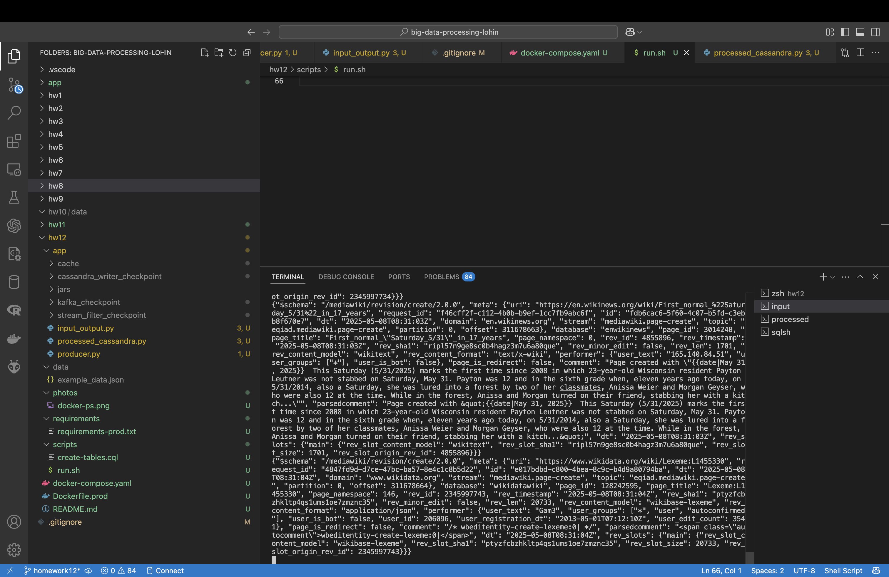
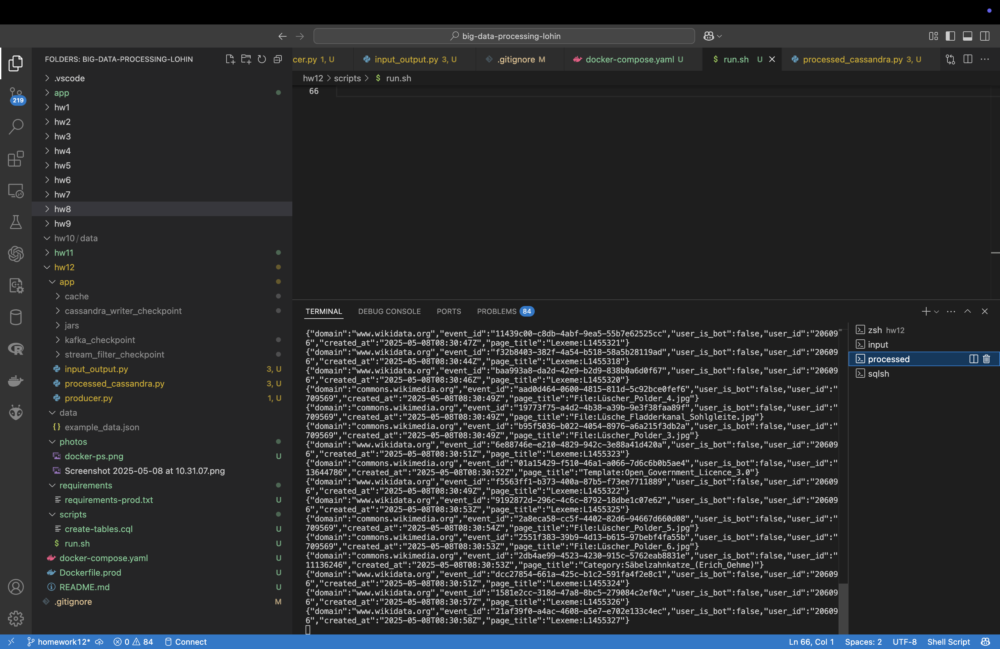
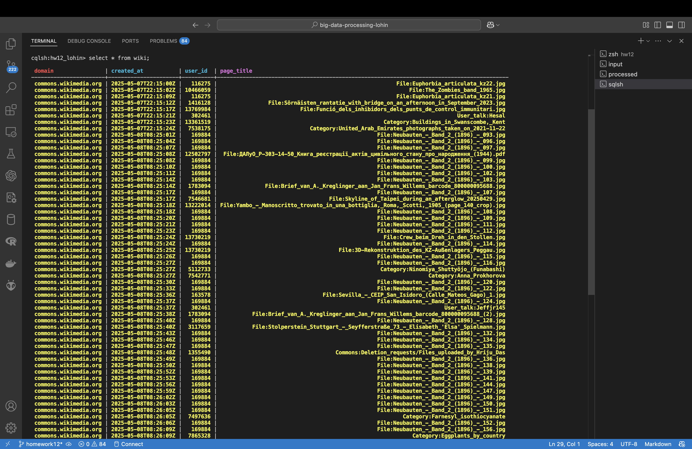

# Homework 12: 🤖 Spark Streaming with Cassandra and Kafka

Author: **Lohin Yurii**

## 🖥 Usage

### How to run the application

1. Clone the repository
1. Navigate to folder hw12
1. To run:
    - Spark cluster (master and worker)
    - Kafka with Zookeeper
    - Cassandra node
    - Producer 

    use `docker compose up -d`
1. To run Spark Streaming programs:
    - Run a python app with script `./scripts/run.sh`. Don't forget to give a permition and change path in script. 
    - First program reads `input` topic, formats it, gets only good data and sends to `processed` topic.
    - Second program reads data from `processed` topic and writes data to `Cassandra`
1. To stop a container of Spark with `docker compose down`

### Results

1. Proof of running all containers
    
1. Proof of running `input` topic
    
1. Proof of running `processed` topic
    
1. Proof of writing to `Cassandra`
    
